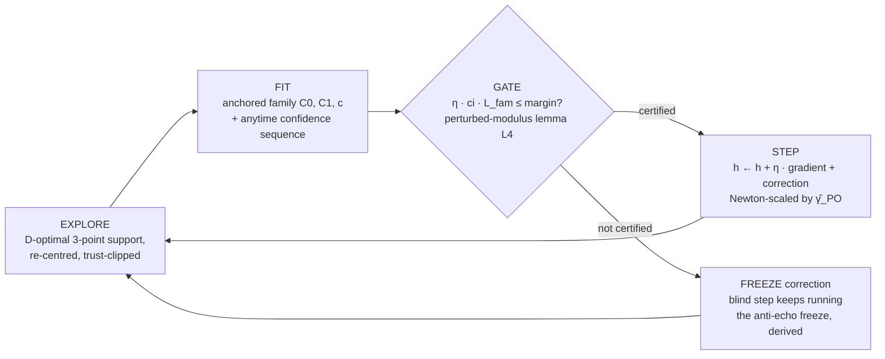

<div align="center">

# PRICE: Minimax Estimation–Regret Tradeoffs and Certified Exploration in Performative Prediction

### Minimax information–cost tradeoffs and optimal exploration in performative systems

[]()
[]()
[]()
[]()
[]()
[]()

</div>

---

A decision-maker whose deployed policy reshapes its own data — a market
maker whose quotes summon toxic flow, a seller whose price anchors
demand, a model retrained on data its own deployment influenced — must
**pay, in its own objective, to learn how it moves the world**.

This repository derives the exact price of that self-knowledge, and then
verifies every closed form inside a live deploy–observe–fit–correct
loop:

1. **A conservation law** — what learning your own influence costs, no
   matter how you explore.
2. **A minimax floor** — proof (and adversarial numerics) that no policy
   evades it.
3. **An optimal-design theory** — how to spend an exploration budget
   priced by your own curvature.
4. **A deployable agent** — SafeD-PerfGD, which never exploits an
   estimate it cannot certify.

> [!NOTE]
> **Verification status:** 25 registered theoretical results ·
> 34/34 derivation checks · 36/36 pipeline rows (35 PASS + 1 deliberate
> out-of-scope DRIFT, 0 FAIL) · 9 unit tests · 10/10 real-data
> calibration cells reproducing the published REFLEX run · all in CI.
> Ten measurement-forced pivots recorded in place.

---

## Contents

- [The four headline results](#the-four-headline-results)
- [The agent: SafeD-PerfGD](#the-agent-safed-perfgd)
- [Repository layout](#repository-layout)
- [Verification-first methodology](#verification-first-methodology)
- [Real-data leg](#real-data-leg-reflex-calibration)
- [Reproduce](#reproduce)
- [Workshop fit (NeurIPS 2026 ML×OR)](#workshop-fit-neurips-2026-mlor)
- [Honest limitations](#honest-limitations)
- [Relation to REFLEX · citation](#relation-to-reflex)

---

## The four headline results

| | Result | What it says | Verified by |
|---|---|---|---|
| **1** | **The exchange rate** (T2/T4) | Along any stationary exploration policy, `Var(ε̂) × C_T = ½ γ_PO σ²`. Slope uncertainty times cumulative performative cost is an invariant of the *environment*, not the policy — you cannot learn your own influence more cheaply, only choose what to buy. | E2 (4 cells, flat in amplitude and modulus) · E8 (exact in the LQ pricing domain) |
| **2** | **The floor is minimax — and structure-proof under curvature uncertainty** (T3/T4, OPEN-1) | No non-anticipating policy beats the floor. Adversarial search shows even a policy that *knows the response family* bottoms out at 1.005× the floor — and the exact boundary is mapped: with the decay rate known a priori, tight-side probing breaks it (→ 0.05). The floor is protected by curvature uncertainty. | `run_open1.py` → `results/OPEN1.md` |
| **3** | **Optimal exploration shaping** (T5a/C5.1) | Under a budget priced by the decision-maker's own curvature `Γ_PO`, the optimal exploration covariance is `Γ_PO^{-1/2}`-shaped; isotropic exploration overpays by the dispersion factor `F = d·tr Γ / (tr Γ^{1/2})²`. | E3 (static: 1.53 vs 1.51 predicted) · E10 (running loop: 1.21 on a dispersed universe, exact null on the flat control) |
| **4** | **Certify before you exploit** (L4/P7.1) | SafeD-PerfGD gates its performative correction behind a pessimistic certificate on its own closed-loop stability. It reaches the performative optimum `h_PO` where blind retraining settles at the worse point `h_SP`; no published baseline Pareto-dominates it; the unsafe gradient baseline pays >5× its regret. | E4 · E6 · E7 · E8 |

**Supporting results:** information saturation of free data + the
retraining-noise excitation floor `(σ/γ)²/(1−m²)` (T1, E1) · the
anchoring crossover — structure beats nonparametrics until
misspecification exceeds `|τ‴|B/(3γ_PO T)` (T7, E5) · Chebyshev
unidentifiability of degenerate designs (T6), hit in the wild twice
(E4 narrow jitter, E8 collinear probes).

<p align="center">

<br/>
<em>The signature: ~1,300 deployments frozen at the blind fixed point
while the certificate accumulates design energy — then the gate opens
and the agent steps to the performative optimum.</em>
</p>

---

## The agent: SafeD-PerfGD



Nothing in the architecture is market-specific: the same gate,
correction, and scaling transplanted to linear-quadratic performative
**pricing** reach the pricing optimum (E8), and the vector version runs
a **d-dimensional multi-bond book** with `Γ_PO^{-1/2}`-shaped
exploration (E10).

**Baselines implemented on the identical interface:** BlindRRM (the
retraining cobweb) · JitterPerfGD (isotropic + OLS) · FD-PerfGD
(Izzo-style finite differences) · ZO-PerfOpt (zeroth-order on noisy
P&L) · UCB-Grid (performative confidence bounds).

---

## Repository layout

```
posk-repo/
├─ mlxor-derivations/          # the mathematical foundation
│  ├─ derivations/             # 9 derivation documents (notation → proofs)
│  ├─ THEOREMS.md              # register: 25 results with proof status
│  ├─ latex/                   # macros, statements, appendix proofs
│  ├─ VERIFICATION.md          # 34 checks + 3 recorded falsifications
│  ├─ OPEN-PROBLEMS.md         # the workshop→journal delta
│  ├─ NOVELTY-CROSSWALK.md     # claim-by-claim vs the literature
│  └─ verify/                  # verify_all.py · check_docs.py
└─ posk-pipeline/              # the ML architecture, live
   ├─ posk/
   │  ├─ theory.py             # closed forms: γ, γ_PO, h_SP, h_PO, designs
   │  ├─ env.py                # StructuralEnv · SaturatingEnv (drift cell)
   │  ├─ estimators.py         # OLS + anytime CS · anchored structural fit
   │  ├─ design.py             # D-optimal support · Fisher · schedulers
   │  ├─ agents.py             # BlindRRM · JitterPerfGD · SafeD-PerfGD
   │  ├─ baselines.py          # FD-PerfGD · ZO-PerfOpt · UCB-Grid
   │  ├─ pricing.py            # 2nd domain: LQ performative pricing
   │  └─ multibond.py          # d-dim market + VectorSafeD
   ├─ experiments/
   │  ├─ run_all.py            # E1–E10 measured-vs-predicted harness
   │  ├─ run_open1.py          # OPEN-1 adversarial premise check
   │  ├─ run_realdata.py       # REFLEX calibration leg (10/10 cells)
   │  └─ figures.py            # the 7 paper figures
   ├─ results/                 # RESULTS.md · OPEN1.md · REALDATA.md · figures/
   └─ tests/                   # 9 unit tests
```

---

## Verification-first methodology

Every quantitative claim in the paper is a row in
[`results/RESULTS.md`](posk-pipeline/results/RESULTS.md): a *pipeline
measurement* against a *closed form*, stamped **PASS / DRIFT / FAIL**
(DRIFT = deliberately out-of-scope cell; CI fails on FAIL only). The
suite was run adversarially against the theory throughout development.

> [!IMPORTANT]
> **Ten pivots were forced by measurement — each recorded in the code
> where it happened, and several became results.** The theory was
> sharpened by its failures, never patched around them.

<details>
<summary><b>The ten recorded pivots</b> (click to expand)</summary>

1. **The feedback floor (E1).** The noiseless saturation cap failed 4×
   against the noisy loop → retraining converts observation noise into
   deployment noise with gain 1/γ, adding a stationary floor
   `(σ/γ)²/(1−m²)`. A new verified closed form.
2. **The honest gate (E4).** The gate never certified at first — because
   certification takes design energy, and the operating point is flat.
   Certification time *is* the exchange rate at work; it gets easier at
   the optimum, where curvature rises. Both now measured.
3. **Trust accounting (E4).** The checker forgot probes legitimately
   span the design support; the agent never violated its clip.
4. **Misspecification must live at the operating point (E5).** The first
   injected error had decayed to ~0 where the agent operates — the
   anchored fit rightly never saw it. Replaced by a linear leak; the T7
   crossover then appears exactly as predicted.
5. **Raw regret is the wrong criterion (E6).** UCB-Grid wins cumulative
   regret — deliberately reported. Safety and identification are
   *purchased*; the recorded criterion is Pareto dominance (none
   dominates SafeD).
6. **Deterministic probes are a T6 instance (E8).** Alternating ±r
   probes in the pricing domain make price and its lag perfectly
   collinear — design degeneracy in the wild. Randomized signs restore
   identification.
7. **Single-window risk is one χ² draw (E10).** The shaped-vs-isotropic
   effect was invisible until measured at steady state over independent
   windows: ratio 1.21 dispersed, 1.00 flat control.
8. **The 75.8× config trap (real data).** The first calibration port
   used dataclass defaults instead of the published run's YAML
   overrides — moduli off 75.8×, 0/10 cells matching. With the right
   constants: 10/10. The validation harness caught it.
9. **Fairly-funded ablations (E7).** A single-draw proxy inverted
   between profiles, and the ablation arm had half the design's realized
   energy. Fairly funded: the "3× shape effect" collapsed to parity —
   T6's cliff is a support/amplitude phenomenon, not a shape one. The
   rows now assert that measured boundary.
10. **The floor is structure-proof (OPEN-1).** Trying to break the
    theorem with family-knowing designs failed (ratio ≥ 1.005; tight
    probes monotonically worse) — and mapped its exact scope: curvature
    uncertainty is what protects the floor.

</details>

---

## Real-data leg (REFLEX calibration)

Constants ported from the REFLEX corporate-bond calibration (public
macro + bond-factor series; 10 rating × regime cells), **validated
cell-by-cell against REFLEX's published paper-grade run before use:
10/10 cells reproduce** `h*`, `ε* = γ`, and the modulus within 0.5–5%.
Each cell is then extended with this paper's objects:

- `γ_PO` spans **510.6** (IG-calm) → **2.3** (HY-crisis)
- Echo-chamber gaps `h_SP − h_PO`: 2–4% of the anchor spread
- Curvature dispersion: **F = 1.63 across the portfolio** of cells
  (isotropic exploration overpays ~63% at the portfolio level) vs
  F = 1.002 within a single homogeneous book — dispersion lives across
  ratings and regimes, not within one.

> [!WARNING]
> **Provenance (binding):** only (A, k, σ, h) are data-identified; the
> toxic channel is structurally scaled; this is not trade-level TRACE.
> Calibrated moduli sit deep in the stable regime (m ≈ 0.065) — the
> real-data leg validates the machinery and the units, not the size of
> the effect.

---

## Reproduce

```bash
pip install -r posk-pipeline/requirements.txt

cd posk-pipeline
python tests/test_posk.py                # 9 unit tests          ~1 min
python experiments/run_all.py --fast     # verification table    ~10 min
python experiments/run_all.py            # full profile          ~30 min
python experiments/run_open1.py          # OPEN-1 premise check  ~1 min
python experiments/run_realdata.py       # needs REFLEX tree; else skips
python experiments/figures.py            # 7 figures (after run_all)

cd ../mlxor-derivations
python verify/verify_all.py              # 34 derivation checks
python verify/check_docs.py              # document-consistency suite
```

Deterministic from seeds · numpy-only (matplotlib for figures) ·
CPU-only · both folders ship GitHub Actions CI running the full
verification.

---

## Workshop fit (NeurIPS 2026 ML×OR)

Submitting to the **Second Workshop on ML×OR** — *Mathematical
Foundations and Operational Integration of Machine Learning for
Uncertainty-Aware Decision-Making* (NeurIPS 2026, Atlanta, Dec 12–13;
INFORMS APS-supported; 4-page NeurIPS format + unlimited appendix;
non-anonymous; non-archival; workshop-to-journal pathway).

This is a **core-scope foundations paper**, not a GenAI paper. Its
connection to the 2026 special theme (decision-making with GenAI + OR)
is through the theme's *agentic* bullet, plus motivation:

| Workshop axis | This paper |
|---|---|
| Mathematical foundations | A conservation law, its minimax floor (van Trees / Le Cam), optimal design theory, and a stability-certified correction lemma — OR-style analysis of an ML-native problem (performative prediction) |
| Uncertainty-aware decision-making | Anytime confidence sequences translated through the perturbed-modulus lemma into *certified* closed-loop margins; pessimism as an operational rule; freezing as the safe fallback |
| Agentic AI for closed-loop decision-making *(2026 theme)* | SafeD-PerfGD is an agentic closed-loop agent for autonomous operation: it explores under a priced budget, certifies its own stability from its own deployment history, and only then exploits |
| Self-influencing deployed models *(2026 theme, motivation)* | Performative feedback — a deployed model reshaping the distribution it retrains on — is the formal structure behind GenAI deployment/retraining loops; the exchange rate prices what any such system pays to learn its own influence |
| Operational integration / OR substance | Two instantiated economies (market-making microstructure, dynamic pricing); exploration priced in the decision-maker's *own objective*; a calibrated real-data leg |
| Journal pathway | [`OPEN-PROBLEMS.md`](mlxor-derivations/OPEN-PROBLEMS.md) is the explicit workshop→journal delta; pathway indication: *Mathematics of Operations Research* |

---

## Honest limitations

- The exchange-rate identity is **local** (A1): finite-amplitude
  wide-side probing undercuts it polynomially (measured 0.966); the
  saturating environment drifts +16% (the DRIFT cell). The
  o(1)-amplitude qualifier is load-bearing.
- The floor's structure-proofness **requires curvature uncertainty**;
  with the decay rate known a priori it breaks (measured → 0.05). Beyond
  the two-point prior class the minimax statement is numerically
  supported, not proved (OPEN-1).
- The D-optimal design's identification advantage lives at **small
  (priced) amplitude and in cross-dimension allocation**; at matched
  transit-scale energy, full-support jitter identifies on par (E7).
- VectorSafeD's exploration shape uses the model's own curvature
  bookkeeping (documented as partially oracle); E10's dispersed universe
  is synthetic, with a flat control.
- Real-data caveats as flagged above.

---

## Relation to REFLEX

The environment is a self-contained simplification of the **REFLEX**
structural OTC market model (performative prediction realized in
market-making microstructure). REFLEX supplies the calibrated constants
and the published run this repository validates against; the symbol map
is [`SYMBOLS-TO-REFLEX.md`](mlxor-derivations/SYMBOLS-TO-REFLEX.md).

**License:** MIT
